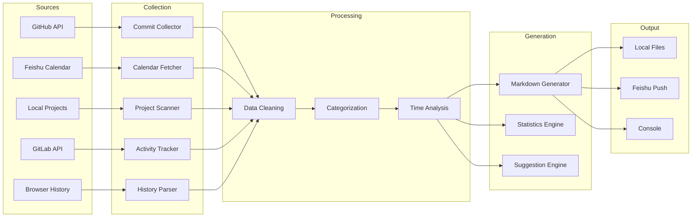
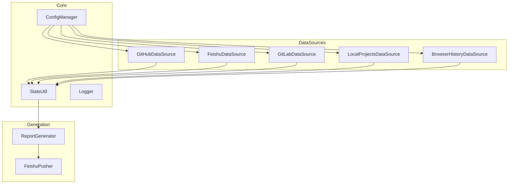

# Daily Work Summary

Automated daily work report generator that consolidates GitHub commits, Feishu calendar events, and project progress.

---

## Overview

Daily Work Summary aggregates data from multiple sources to generate structured daily reports. It tracks your development activity, meetings, and project progress, then delivers reports to Feishu or saves them locally.

| Feature | Description |
|---------|-------------|
| Multi-source Data | Collects from GitHub, Feishu Calendar, GitLab, local projects, and browser history |
| Smart Analysis | Categorizes work by project and calculates time allocation |
| Report Generation | Produces Markdown reports with statistics and insights |
| Automated Delivery | Pushes reports to Feishu with one command |

---

## Quick Start

### Prerequisites

- Node.js >= 18.0.0
- npm or yarn

### Installation

```bash
cd daily-work-summary
npm install
```

### Configuration

```bash
npm run config
```

Or manually edit `config/config.json`.

### Generate Report

```bash
npm start
```

---

## Data Flow Architecture



### Component Architecture



---

## Data Sources

| Source | Data Collected | Authentication |
|--------|---------------|----------------|
| GitHub | Commits, PRs, Issues | gh CLI or Token |
| Feishu | Calendar events, Meetings | App Token |
| GitLab | Commits, MRs | Token |
| Local Projects | Git activity, File changes | None |
| Browser History | Development-related visits | Local DB |

---

## Configuration

### config/config.json

```json
{
  "github": {
    "username": "your-github-username",
    "token": "ghp_xxxxxxxx",
    "repos": ["owner/repo1", "owner/repo2"]
  },
  "feishu": {
    "appId": "cli_xxxxxxxx",
    "appSecret": "xxxxxxxx",
    "chatId": "oc_xxxxxxxx"
  },
  "localProjects": {
    "enabled": true,
    "scanPaths": ["/path/to/projects"],
    "maxDepth": 2
  },
  "report": {
    "format": "markdown",
    "includeWeeklyComparison": true,
    "pushToFeishu": true
  }
}
```

---

## CLI Options

```bash
# Generate today's report
npm start

# Specify date
npm start -- --date 2026-03-10

# Specify output format
npm start -- --format json

# Skip Feishu push
npm start -- --no-push

# View help
npm start -- --help
```

---

## Example Report

```markdown
# Daily Work Report
Generated: 2026-03-11 23:30:00

## Overview

| Metric | Value |
|--------|-------|
| Commits | 12 |
| Code Changes | +580 / -120 |
| Meeting Hours | 2.5h |
| Work Hours | 8.5h |

## Completed Tasks

### client-evaluator
- feat: add smart quoting (+156 / -23)
- fix: Feishu push issue (+45 / -12)
- docs: update README (+89 / -5)

### daily-work-summary
- feat: multi-source integration (+234 / -56)
- refactor: optimize code structure (+56 / -24)

## Schedule Review

| Time | Event | Duration |
|------|-------|----------|
| 09:00-09:30 | Morning Standup | 0.5h |
| 14:00-15:30 | Project Review | 1.5h |
| 16:00-16:30 | Tech Discussion | 0.5h |

## Tomorrow's Plan

- [ ] Complete client evaluator testing
- [ ] Optimize report generation performance
- [ ] Organize project documentation

## Statistics

Code Changes by Project:
```
client-evaluator     ████████████████████ 290 lines
daily-work-summary   ██████████████ 214 lines
agent-tracer         ████ 76 lines
```
```

---

## Project Structure

```
daily-work-summary/
├── src/
│   ├── index.js              # Main entry
│   ├── datasource/
│   │   ├── github.js         # GitHub integration
│   │   ├── feishu.js         # Feishu calendar
│   │   ├── gitlab.js         # GitLab integration
│   │   ├── local-projects.js # Local project scanner
│   │   └── browser-history.js# Browser activity
│   ├── generator/
│   │   └── report.js         # Report generation
│   ├── pusher/
│   │   └── feishu.js         # Feishu delivery
│   └── utils/
│       ├── config.js         # Configuration manager
│       ├── stats.js          # Statistics utilities
│       └── logger.js         # Logging utilities
├── config/
│   ├── config.json           # User configuration
│   └── config.example.json   # Example config
├── templates/
│   └── daily-report.md       # Report template
├── reports/                  # Generated reports
├── docs/                     # Documentation
└── package.json
```

---

## API Usage

### DataSource Classes

```javascript
import { GitHubDataSource } from './datasource/github.js';

const github = new GitHubDataSource({
  username: 'your-username',
  token: 'your-token'
});

const commits = await github.getTodayCommits(new Date());
console.log(`Total commits: ${commits.totalCommits}`);
```

### Report Generator

```javascript
import { ReportGenerator } from './generator/report.js';

const generator = new ReportGenerator(config);
const report = await generator.generate({
  github: githubData,
  feishu: feishuData,
  localProjects: localData
});

await generator.save(report, './reports/2026-03-11.md');
```

---

## License

MIT
