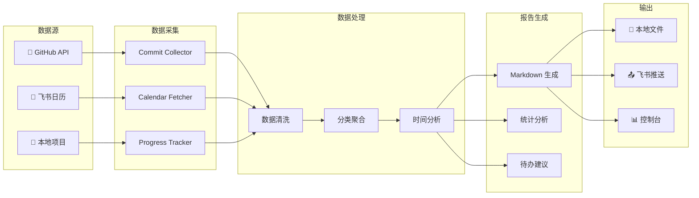
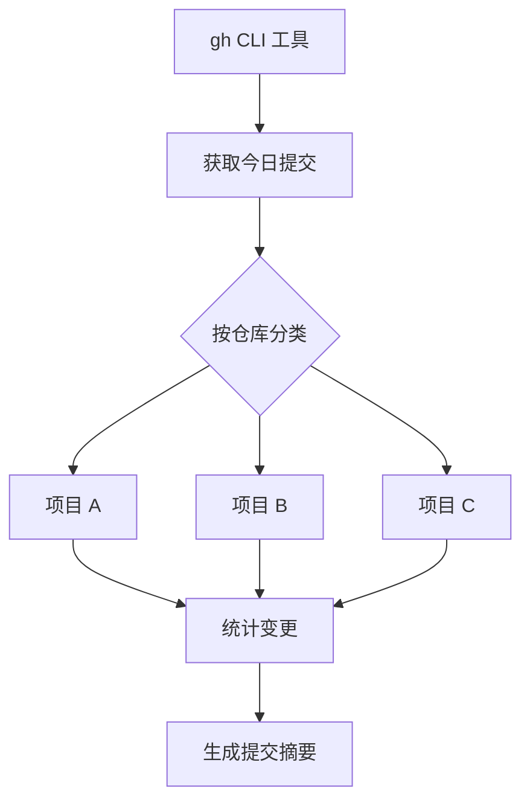

<div align="center">
  
</div>

<div align="center">
  
  [](https://github.com/lizuyi-6/daily-work-summary)
  [](LICENSE)
  [](https://nodejs.org)
  
</div>

<p align="center">
  <b>自动整合 GitHub commits、飞书日程、项目进度等数据</b><br>
  <sub>生成结构化日报并推送到飞书</sub>
</p>

---

## 📑 目录

- [✨ 功能特性](#-功能特性)
- [🚀 快速开始](#-快速开始)
- [📊 数据流架构](#-数据流架构)
- [🔌 数据源说明](#-数据源说明)
- [📁 项目结构](#-项目结构)
- [💡 输出示例](#-输出示例)
- [⚙️ 配置说明](#️-配置说明)
- [🔧 命令选项](#-命令选项)

---

## ✨ 功能特性

<table>
<tr>
<td width="50%">

### 📊 多数据源整合
- 🐙 **GitHub Commits** - 自动获取提交记录
- 📅 **飞书日历** - 日程时间分析
- 📁 **项目进度** - 本地项目追踪
- 🔗 **关联分析** - Issues/PRs 关联

</td>
<td width="50%">

### 📝 智能日报生成
- 📋 **Markdown 格式** - 结构化输出
- ⏰ **时间分配** - 智能统计分析
- 📈 **进度追踪** - 可视化指标
- 🎯 **待办建议** - 明日计划生成

</td>
</tr>
<tr>
<td width="50%">

### 🚀 自动化推送
- 📤 **飞书推送** - 一键发送日报
- ⏱️ **定时任务** - 自动生成报告
- 🔄 **增量更新** - 实时数据同步

</td>
<td width="50%">

### ⚙️ 灵活配置
- 🎛️ **多模板支持** - 自定义报告格式
- 🔐 **安全认证** - Token 安全管理
- 📦 **插件系统** - 可扩展数据源

</td>
</tr>
</table>

---

## 🚀 快速开始

### 1️⃣ 安装依赖

```bash
cd daily-work-summary
npm install
```

### 2️⃣ 初始化配置

```bash
npm run config
```

或手动编辑 `config/config.json` 文件。

### 3️⃣ 运行日报生成

```bash
npm start
```

---

## 📊 数据流架构



---

## 🔌 数据源说明

### 🐙 GitHub Commits



- 使用 `gh` CLI 工具获取
- 支持多仓库配置
- 自动按项目分类
- 统计代码变更行数

### 📅 飞书日程

- 通过飞书 API 获取当日日程
- 分析时间分配
- 提取会议和待办事项
- 计算工作时长

### 📁 项目进度

- 支持本地项目跟踪
- 可关联 GitHub issues/PRs
- 自定义进度指标
- 状态自动更新

---

## 📁 项目结构

```
daily-work-summary/
├── 📂 src/
│   ├── 📄 index.js           # 主入口
│   ├── 📄 collector.js       # 数据采集
│   ├── 📄 analyzer.js        # 数据分析
│   ├── 📄 generator.js       # 报告生成
│   └── 📄 pusher.js          # 推送服务
├── 📂 config/
│   ├── 📄 config.json        # 配置文件
│   └── 📄 config.example.json
├── 📂 templates/
│   └── 📄 daily-report.md    # 日报模板
├── 📂 reports/               # 生成的报告
├── 📂 docs/                  # 文档和资源
└── 📄 package.json
```

---

## 💡 输出示例

### 📋 日报格式

````markdown
# 📊 每日工作报告
> 生成时间: 2026-03-11 23:30:00

## 🎯 今日概览

| 指标 | 数值 |
|------|------|
| 提交次数 | 12 |
| 代码变更 | +580 / -120 |
| 会议时长 | 2.5h |
| 工作时长 | 8.5h |

## ✅ 完成事项

### 📦 client-evaluator
- `feat: 添加智能报价功能` (+156 / -23)
- `fix: 修复飞书推送问题` (+45 / -12)
- `docs: 更新 README 文档` (+89 / -5)

### 📦 daily-work-summary
- `feat: 实现多数据源整合` (+234 / -56)
- `refactor: 优化代码结构` (+56 / -24)

## 📅 日程回顾

| 时间 | 事件 | 时长 |
|------|------|------|
| 09:00-09:30 | 晨会 | 0.5h |
| 14:00-15:30 | 项目评审 | 1.5h |
| 16:00-16:30 | 技术讨论 | 0.5h |

## 📝 明日计划

- [ ] 完成客户评估器测试
- [ ] 优化日报生成性能
- [ ] 整理项目文档

## 📈 统计图表

```
代码变更统计:
████████████████████████████████████████ +580
████████ -120
```
````

<details>
<summary>📸 查看更多输出示例</summary>

### 控制台输出

```
🚀 开始收集数据...

✅ GitHub Commits: 12 条提交
✅ 飞书日程: 3 个事件
✅ 项目进度: 2 个更新

📊 正在分析数据...
  • 代码变更: +580 / -120
  • 工作时长: 8.5h
  • 会议时间: 2.5h

📝 生成报告...
✅ 报告已保存: reports/2026-03-11.md

📤 推送到飞书...
✅ 推送成功！

⏱️  耗时: 2.3s
```

</details>

---

## ⚙️ 配置说明

### config/config.json

```json
{
  "github": {
    "repos": ["lizuyi-6/client-evaluator", "lizuyi-6/daily-work-summary"],
    "since": "today"
  },
  "feishu": {
    "calendarId": "primary",
    "timezone": "Asia/Shanghai"
  },
  "output": {
    "format": "markdown",
    "directory": "./reports"
  },
  "push": {
    "enabled": true,
    "channel": "feishu"
  }
}
```

---

## 🔧 命令选项

```bash
# 生成今日日报
npm start

# 指定日期
npm start -- --date 2026-03-10

# 指定输出格式
npm start -- --format json

# 不推送到飞书
npm start -- --no-push

# 查看帮助
npm start -- --help
```

---

## 📄 License

MIT

---

<div align="center">
  
  **[⬆ 回到顶部](#-目录)**
  
  Made with ❤️
  
</div>
